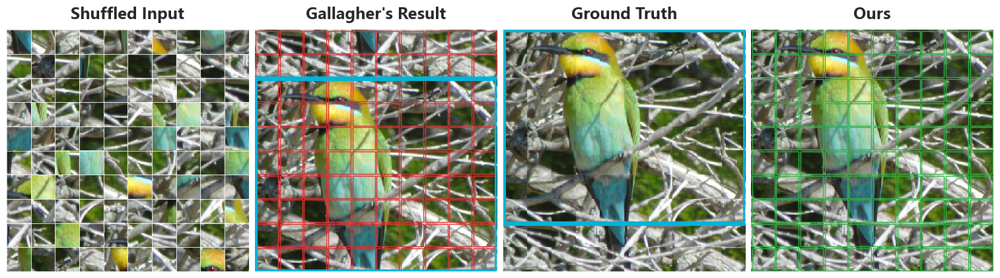
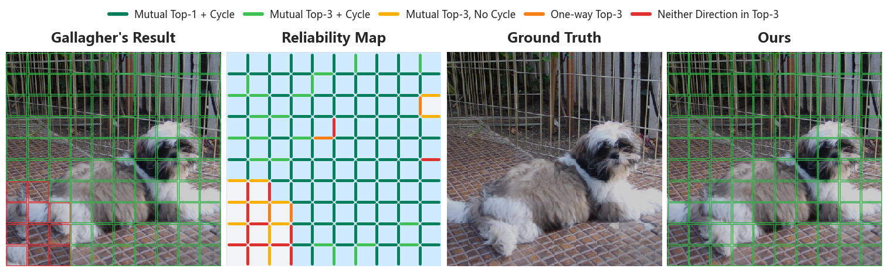

# RG-LNS

**Reliability-Guided Large Neighborhood Search for Eroded Jigsaw Puzzle Reassembly**

**Paper status:** Under review at ICASSP 2027.

[](LICENSE)

RG-LNS formulates the correction of assembled eroded-jigsaw layouts as a
separate combinatorial optimization problem under fixed directional
compatibility. Our framework decouples visual perception from spatial
reasoning: a ViT-Tiny (ViT-T) model learns directional compatibility between
pieces, while RG-LNS corrects the resulting layouts without retraining the
visual model.

We construct three two-stage baselines by pairing the same frozen ViT-T
compatibility with Gallagher, Pomeranz, and linear programming (LP) as layout
optimizers. Experiments are conducted on GAP, JPwLEG-5, and our ImageNet
Large-Scale Eroded Jigsaw (ImageNet-LSEJ) dataset.

> **Release status.** The paper-facing implementation is organized by method
> stage. The numerical training, initial-solver, and RG-LNS routines retain the
> submitted implementation; only paths, module names, and public dispatchers
> were changed. See the [reproducibility notes](docs/reproducibility.md) and
> [source manifest](docs/source_manifest.md).

## Code layout

```text
compatibility/          Stage I: ViT compatibility model, scorer, and training
data_loaders/           GAP, JPwLEG, and ImageNet-LSEJ adapters
initial_solvers/        Gallagher, Pomeranz, LP, and partial-layout completion
rg_lns/                 Stage II: the proposed destroy/translate/repair search
evaluation/             Metrics plus explicit dataset/solver evaluation commands
experiments/            Ablation, sensitivity, runtime, and failure analysis
datasets/               Local data only; ignored by Git
checkpoints/            Local pretrained/trained weights; ignored by Git
results/reference/      Compact records from the submitted experiments
results/runs/           Newly generated runs; ignored by Git
```

Stage-I perception is deliberately outside `rg_lns/`. The latter contains
only the proposed layout-correction algorithm and consumes a fixed directional
compatibility tensor plus an initial layout.

## Installation

The verified development environment uses Python 3.10 and the package versions
listed in `requirements.txt`.

```bash
python -m venv .venv
# Windows: .venv\Scripts\activate
python -m pip install -r requirements.txt
```

For CUDA, install the PyTorch build matching the local driver before installing
the remaining requirements.

## Data and checkpoints

Keep uncompressed datasets at these exact local paths:

```text
datasets/GAP_fast/GAP-3
datasets/GAP_fast/GAP-5
datasets/MET_Dataset/JPLEG-5
datasets/ImageNet_LSEJ/configs
datasets/ImageNet_LSEJ/images
```

The six model files are available in the public
[v0.1.0 checkpoint release](https://github.com/ChangxinYe/RG-LNS/releases/tag/v0.1.0).
Download the files you need and place them under the repository root exactly
as shown below:

```text
checkpoints/
├── pretrained/
│   └── vit_tiny_patch16_224_augreg_in21k_ft_in1k_handwritten.pth
└── compatibility/
    ├── gap3_best.pth
    ├── gap5_best.pth
    ├── jpleg5_best.pth
    ├── lsej_grid10_erode2_best.pth
    └── lsej_grid10_erode5_best.pth
```

| Download | Save as, relative to the repository root | Used for |
|:--|:--|:--|
| [ViT-Tiny pretrained weights](https://github.com/ChangxinYe/RG-LNS/releases/download/v0.1.0/vit_tiny_patch16_224_augreg_in21k_ft_in1k_handwritten.pth) | `checkpoints/pretrained/vit_tiny_patch16_224_augreg_in21k_ft_in1k_handwritten.pth` | Training initialization |
| [GAP-3 checkpoint](https://github.com/ChangxinYe/RG-LNS/releases/download/v0.1.0/gap3_best.pth) | `checkpoints/compatibility/gap3_best.pth` | GAP-3 evaluation |
| [GAP-5 checkpoint](https://github.com/ChangxinYe/RG-LNS/releases/download/v0.1.0/gap5_best.pth) | `checkpoints/compatibility/gap5_best.pth` | GAP-5 evaluation |
| [JPwLEG-5 checkpoint](https://github.com/ChangxinYe/RG-LNS/releases/download/v0.1.0/jpleg5_best.pth) | `checkpoints/compatibility/jpleg5_best.pth` | JPwLEG-5 evaluation |
| [ImageNet-LSEJ erode2 checkpoint](https://github.com/ChangxinYe/RG-LNS/releases/download/v0.1.0/lsej_grid10_erode2_best.pth) | `checkpoints/compatibility/lsej_grid10_erode2_best.pth` | `grid10_erode2` evaluation |
| [ImageNet-LSEJ erode5 checkpoint](https://github.com/ChangxinYe/RG-LNS/releases/download/v0.1.0/lsej_grid10_erode5_best.pth) | `checkpoints/compatibility/lsej_grid10_erode5_best.pth` | `grid10_erode5` evaluation |

For evaluation, only the checkpoint matching the dataset or task is needed;
pass its local path with `--checkpoint` as in the commands below. The
pretrained ViT-Tiny file is needed when training Stage I from scratch.
`checkpoints/` is ignored by Git, so downloaded weights stay local. Training
writes complete run directories under `checkpoints/train_<dataset>/`.

## Main commands

```bash
# Stage-I compatibility training
python train_compatibility.py gap --dataset GAP-5
python train_compatibility.py jpleg --dataset jpleg5
python train_compatibility.py lsej --task grid10_erode2

# Initial layout only, or the final RG-LNS correction
python evaluate.py gap gallagher initial --checkpoint checkpoints/compatibility/gap5_best.pth
python evaluate.py gap gallagher rg-lns --checkpoint checkpoints/compatibility/gap5_best.pth
python evaluate.py lsej linear-programming rg-lns --checkpoint checkpoints/compatibility/lsej_grid10_erode2_best.pth

# Paper-level experiments
python reproduce.py ablation
python reproduce.py sensitivity
python reproduce.py runtime
```

Run the lightweight synthetic regression tests with:

```bash
python -m unittest discover -s tests -v
```

All original dataset/solver combinations remain available as explicit modules
under `evaluation/commands/`, which keeps each reported path independently
auditable. Compact submitted records are inventoried in
[`results/reference/README.md`](results/reference/README.md).

## Motivation

Even when a complete puzzle layout is incorrect, it can retain many correct
local relationships. Our empirical analysis identifies two dominant failure
modes.

### 1. Region shift

Some regions preserve the correct relative positions among their pieces but
are displaced as a whole. The cyan outline below marks the same region in the
initial layout and its target location.

<p align="center">
  
</p>

### 2. Local ambiguity

Multiple neighboring pieces can exhibit high visual similarity, making their
relative spatial positions difficult to infer. The reliability map below
highlights where the available neighboring relationships provide insufficient
support for an unambiguous arrangement.

<p align="center">
  
</p>

## Method Overview

RG-LNS addresses these two failure modes through reliability-guided destroy
and repair.

1. **Directional compatibility.** The four edges of each piece are mapped to a
   shared canonical orientation and embedded by a frozen ViT-T model.
2. **Reliability-guided destroy.** Mutually strong piece matches supported by
   surrounding pieces are grouped into reliable regions. The internal
   arrangement of the largest reliable region is preserved, while its absolute
   location and the positions of the remaining pieces are released. This
   defines a structured large neighborhood.
3. **Region translation.** The repair operator explores every feasible
   translation of the preserved region, directly addressing region shifts.
4. **Beam-search completion.** For each translation, the remaining pieces are
   placed while multiple layout hypotheses are retained. Newly formed
   adjacencies provide richer compatibility information for distinguishing
   locally ambiguous arrangements.
5. **Evaluation and acceptance.** Completed layouts are evaluated by a fixed
   compatibility objective, and a candidate is accepted only when it strictly
   improves the current layout.

## Main Results

The following tables reproduce the paper's two main comparisons. All metrics
are percentages (higher is better): **PA** is perfect puzzle accuracy, **AA**
is absolute piece-position accuracy, and **SRA** is spatial relationship
accuracy. Each ViT-T baseline and its RG-LNS row use the same frozen
directional compatibility model; bold values show the result after RG-LNS.

### GAP and JPwLEG-5

| Method | GAP-3 PA | GAP-3 AA | GAP-3 SRA | GAP-5 PA | GAP-5 AA | GAP-5 SRA | JPwLEG-5 PA | JPwLEG-5 AA | JPwLEG-5 SRA |
|:--|--:|--:|--:|--:|--:|--:|--:|--:|--:|
| [Pomeranz (CVPR 2011)][pomeranz] | 0.0 | 11.6 | 8.6 | 0.0 | 4.1 | 3.7 | — | — | — |
| [GA (CVPR 2013)][ga] | 0.0 | 11.1 | 8.5 | 0.0 | 11.1 | 8.5 | — | — | — |
| [JigsawGAN (TIP 2022)][jigsawgan] | 4.6 | 45.3 | 35.9 | 0.0 | 18.0 | 12.0 | — | — | — |
| [DiffAssemble (CVPR 2024)][diffassemble]† | 16.4 | 50.5 | 43.4 | 0.0 | 21.9 | 14.7 | 16.4 | 63.0 | — |
| [JPDVT (CVPR 2024)][jpdvt]† | 0.0 | 11.2 | 8.4 | 0.0 | 3.9 | 3.2 | 0.0 | 4.1 | — |
| [ERL-MPP (AAAI 2025)][erlmpp] | — | — | — | — | — | — | 18.6 | 52.7 | — |
| [FCViT (ESWA 2025)][fcvit]† | 25.2 | 60.7 | 47.6 | 0.0 | 20.4 | 13.8 | 2.5 | 43.2 | — |
| [PuzLM (ECCV 2026)][puzlm] | 0.0 | 14.8 | 9.9 | 0.0 | 7.8 | 4.5 | 32.5 | 72.1 | — |
| [PuzzleFlow (CVPR 2026)][puzzleflow] | 28.5 | 62.9 | 55.7 | 0.3 | 29.1 | 19.8 | 0.0 | 29.0 | — |
| ViT-T + [Gallagher][gallagher] | 24.4 | 33.7 | 63.2 | 15.2 | 30.7 | 62.4 | 39.6 | 49.4 | 83.4 |
| ↳ + RG-LNS (ours) | **31.5** | **38.9** | **68.1** | **30.9** | **45.6** | **74.4** | **50.8** | **58.3** | **89.3** |
| ViT-T + [Pomeranz][pomeranz] | 30.2 | 38.2 | 68.0 | 24.7 | 40.6 | 70.9 | 49.1 | 57.4 | 88.1 |
| ↳ + RG-LNS (ours) | **33.7** | **41.1** | **70.0** | **32.9** | **48.7** | **75.8** | **54.4** | **62.2** | **90.1** |
| ViT-T + [LP][lp] | 28.6 | 38.6 | 65.6 | 21.1 | 38.0 | 65.2 | 52.2 | 63.6 | 86.4 |
| ↳ + RG-LNS (ours) | **35.5** | **43.6** | **70.3** | **33.7** | **49.5** | **74.4** | **60.7** | **69.1** | **90.9** |

Linked method names cite the original algorithms. Prior-method results are
reported by [PuzzleFlow][puzzleflow], except the JPwLEG-5 results marked †,
which are reported by [PuzLM][puzlm]. JPwLEG-5 uses the no-fixed-center
protocol; the ViT-T combinations and RG-LNS values are from our experiments.

### ImageNet-LSEJ (10 × 10)

| Method | 2 px PA | 2 px AA | 2 px SRA | 5 px PA | 5 px AA | 5 px SRA |
|:--|--:|--:|--:|--:|--:|--:|
| [Gallagher (CVPR 2012)][gallagher] | 8.3 | 39.9 | 62.8 | 0.0 | 3.1 | 23.7 |
| [JigsawGAN (TIP 2022)][jigsawgan] | 0.0 | 2.1 | 2.2 | 0.0 | 2.1 | 2.0 |
| [Edge2Vec (arXiv 2022)][edge2vec] | 18.2 | 55.7 | 75.3 | 0.2 | 10.8 | 39.8 |
| [JPDVT (CVPR 2024)][jpdvt] | 0.0 | 1.5 | 3.4 | 0.0 | 1.2 | 1.5 |
| [DiffAssemble (CVPR 2024)][diffassemble] | 0.0 | 1.6 | 1.4 | 0.0 | 1.5 | 1.3 |
| [FCViT (ESWA 2025)][fcvit] | 0.0 | 1.0 | 7.2 | 0.0 | 1.0 | 12.5 |
| [PuzzleFlow (CVPR 2026)][puzzleflow] | 0.0 | 7.3 | 4.4 | 0.0 | 6.1 | 3.7 |
| ViT-T + [Gallagher][gallagher] | 39.2 | 72.1 | 86.8 | 5.9 | 32.3 | 61.1 |
| ↳ + RG-LNS (ours) | **53.8** | **83.9** | **91.6** | **19.7** | **53.1** | **74.9** |
| ViT-T + [Pomeranz][pomeranz] | 48.1 | 82.8 | 90.5 | 16.6 | 53.0 | 72.7 |
| ↳ + RG-LNS (ours) | **54.8** | **86.7** | **92.1** | **23.2** | **59.8** | **77.6** |
| ViT-T + [LP][lp] | 44.9 | 80.9 | 88.5 | 9.2 | 39.2 | 63.1 |
| ↳ + RG-LNS (ours) | **55.9** | **85.7** | **91.2** | **18.6** | **50.6** | **72.0** |

Competing methods on ImageNet-LSEJ were reproduced for the paper. The compact
records for our reported runs are inventoried in
[`results/reference/`](results/reference/README.md).

[pomeranz]: https://doi.org/10.1109/CVPR.2011.5995331
[ga]: https://doi.org/10.1109/CVPR.2013.231
[jigsawgan]: https://doi.org/10.1109/TIP.2021.3120052
[diffassemble]: https://openaccess.thecvf.com/content/CVPR2024/html/Scarpellini_DiffAssemble_A_Unified_Graph-Diffusion_Model_for_2D_and_3D_Reassembly_CVPR_2024_paper.html
[jpdvt]: https://openaccess.thecvf.com/content/CVPR2024/html/Liu_Solving_Masked_Jigsaw_Puzzles_with_Diffusion_Vision_Transformers_CVPR_2024_paper.html
[erlmpp]: https://ojs.aaai.org/index.php/AAAI/article/view/32748
[fcvit]: https://doi.org/10.1016/j.eswa.2025.126776
[puzlm]: https://doi.org/10.1007/978-3-032-37281-9_4
[puzzleflow]: https://openaccess.thecvf.com/content/CVPR2026/papers/Shahar_The_Missing_GAP_From_Solving_Square_Jigsaw_Puzzles_to_Handling_CVPR_2026_paper.pdf
[gallagher]: https://doi.org/10.1109/CVPR.2012.6247699
[edge2vec]: https://arxiv.org/abs/2211.07771
[lp]: https://bmva-archive.org.uk/bmvc/2016/papers/paper139/index.html

On the ImageNet-LSEJ failures used for our analysis, RG-LNS repairs
19.3–42.1% of failures attributed to region shift and 13.9–26.8% of those
attributed to local ambiguity across the three baselines.

## Failure Taxonomy for Table 1

This section documents the deterministic sample-level classification used to
produce Table 1 of the paper. The three labels are applied to all failed
predictions from each baseline and form a disjoint partition.

### Step 1: Absolute-position errors

For a complete failed sample $s$, let $\mathbf{x}_i$ and
$\mathbf{x}_i^{*}$ be the predicted and ground-truth grid coordinates of piece
$i$. The set of pieces at incorrect absolute positions is

```math
\mathcal{W}_s=\{i\in\mathcal{P}:\mathbf{x}_i\neq\mathbf{x}_i^{*}\}.
```

Only failed samples are classified, so $|\mathcal{W}_s|>0$ for every complete
prediction considered below.

### Step 2: Reliable components

For a currently adjacent pair $(i,j)$ in direction $d$, let
$r_{i\rightarrow j}^{d}$ be the rank of $j$ among the candidate neighbors of
$i$, where rank 1 is best. The adjacency is mutual Top-$K$ when

```math
\max(r_{i\rightarrow j}^{d},\;r_{j\rightarrow i}^{\bar d})\le K,
```

where $\bar d$ denotes the opposite direction. A current $2\times2$ block
provides cycle support only when all four perimeter adjacencies are mutual
Top-$K$. The reliability graph $G_s^{\mathrm{rel}}$ contains the perimeter
edges supported by at least one such complete cycle. Its connected components
with at least $M$ pieces form

```math
\mathcal{C}_s=
\{Q\in\mathrm{CC}(G_s^{\mathrm{rel}}):|Q|\ge M\}.
```

The experiments use $K=3$ and $M=4$.

### Step 3: Evidence for the two failure modes

For every piece $i$, define the translation needed to move it from its
predicted position to its target position as

```math
\boldsymbol{\Delta}_i=\mathbf{x}_i^{*}-\mathbf{x}_i.
```

A reliable component provides evidence of region shift when all of its pieces
share the same nonzero translation:

```math
\mathcal{C}_s^{\mathrm{shift}}=
\{Q\in\mathcal{C}_s:\exists\,\boldsymbol{\delta}\neq\mathbf{0},\;
\forall i\in Q,\;\boldsymbol{\Delta}_i=\boldsymbol{\delta}\}.
```

Let $\mathcal{R}_s$ contain the pieces covered by shifted reliable components,
and let $\mathcal{L}_s$ contain the pieces outside every reliable component:

```math
\mathcal{R}_s=\bigcup_{Q\in\mathcal{C}_s^{\mathrm{shift}}}Q,
\qquad
\mathcal{L}_s=\mathcal{P}\setminus\bigcup_{Q\in\mathcal{C}_s}Q.
```

We measure how much of the absolute-position error is explained by each type
of evidence:

```math
q_s^{\mathrm{shift}}=
\frac{|\mathcal{W}_s\cap\mathcal{R}_s|}{|\mathcal{W}_s|},
\qquad
q_s^{\mathrm{local}}=
\frac{|\mathcal{W}_s\cap\mathcal{L}_s|}{|\mathcal{W}_s|}.
```

### Step 4: Ordered sample-level classification

With the dominance threshold $\tau=0.4$, the failure label is assigned in the
following order:

```math
y_s=
\begin{cases}
\text{Region shift},
& q_s^{\mathrm{shift}}\ge\tau,\\[2pt]
\text{Local ambiguity},
& q_s^{\mathrm{shift}}<\tau\ \text{and}\ q_s^{\mathrm{local}}\ge\tau,\\[2pt]
\text{Other failure},
& \text{otherwise}.
\end{cases}
```

The ordered rule makes the two dominant categories mutually exclusive.
Predictions that do not define a complete grid permutation are assigned
directly to **Other failure**.

### Table 1 results

The following results are obtained on ImageNet-LSEJ ($10\times10$) with
2-pixel erosion. All three baselines use the same frozen ViT-T directional
compatibility.

| Failure type | Gallagher | Pomeranz | LP |
|:--|--:|--:|--:|
| Region shift | 202 (16.6%) | 107 (10.3%) | 135 (12.3%) |
| Local ambiguity | 731 (60.1%) | 742 (71.6%) | 823 (74.7%) |
| Other failures | 283 (23.3%) | 188 (18.1%) | 144 (13.1%) |
| **Total** | **1,216 (100%)** | **1,037 (100%)** | **1,102 (100%)** |

Displayed percentages are rounded to one decimal place.

## Benchmarks

- **[GAP-3 / GAP-5](https://github.com/OfirShahar/puzzle-flow-matching):**
  public $3\times3$ and $5\times5$ benchmarks with irregular eroded
  fragments.
- **[JPwLEG-5](https://drive.google.com/drive/folders/1MjPm7ar-u6H5WX6Bw2qshPiYPT_eQCZE):**
  a public $5\times5$ benchmark with large gaps, evaluated under the
  no-fixed-center protocol.
- **[ImageNet-LSEJ](https://github.com/ChangxinYe/ImageNet-LSEJ):** our
  $10\times10$ benchmark derived from ImageNet, with $50\times50$-pixel pieces
  under 2- and 5-pixel erosion.

## Acknowledgments

We thank the authors of the following projects for making their code publicly
available. Their implementations supported our ImageNet-LSEJ baseline
evaluation:

- [JigsawGAN](https://github.com/liru0126/JigsawGAN)
- [JPDVT](https://github.com/JinyangMarkLiu/JPDVT)
- [DiffAssemble](https://github.com/IIT-PAVIS/DiffAssemble)
- [FCViT](https://github.com/HiMyNameIsDavidKim/fcvit)
- [PuzzleFlow](https://github.com/OfirShahar/puzzle-flow-matching)

Other baselines were reproduced by following their original papers.

## Citation

Citation information will be added with the public paper release.

## License

This project is released under the [MIT License](LICENSE).
